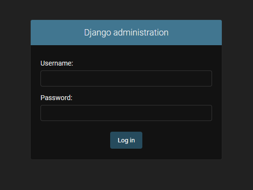
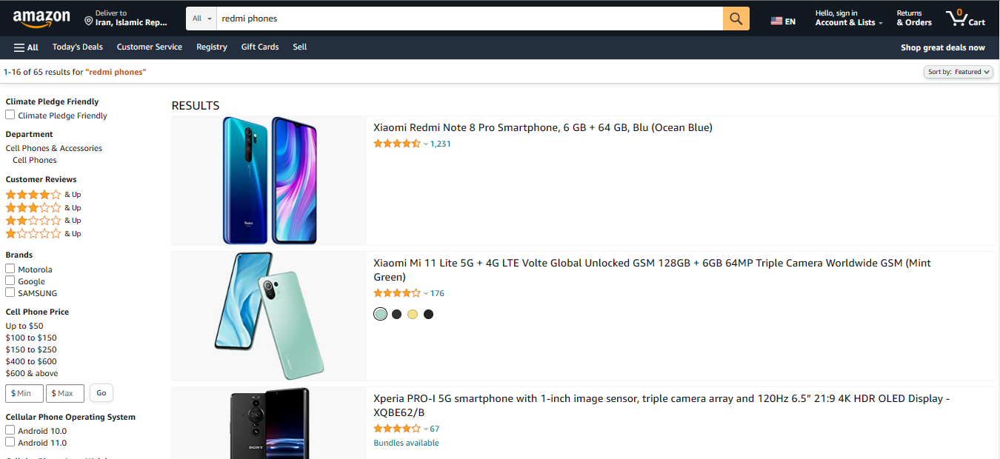
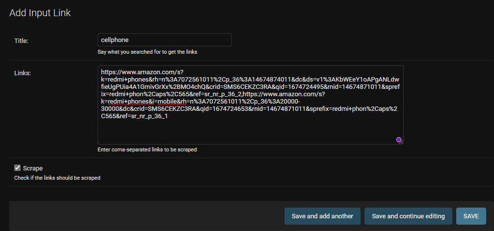
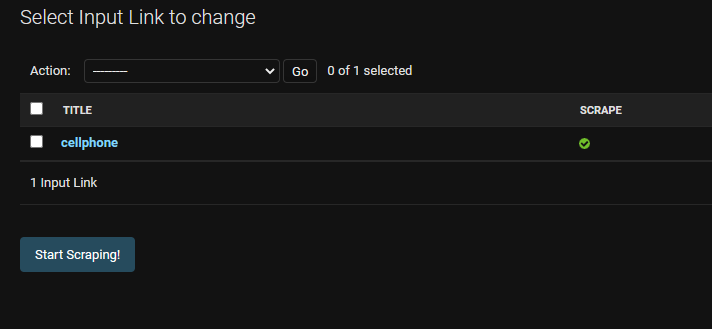
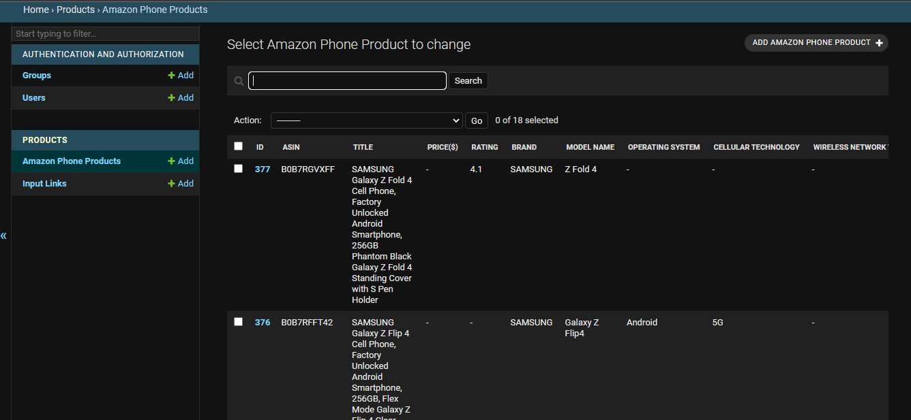

# Amazon Scraper Integration With Django

A simple project to scrape the data of cellphone products from amazon and save them in the database. 

## Start the project

```
git pull https://github.com/FatemeFouladkar/Django-and-Amazon-Scraper-Integration.git

virtualenv .venv
.venv\Scripts\activate.ps1 

pip install -r requirements.txt

python manage.py makemigarations
python manage.py migrate
python manage.py createsuperuser
python manage.py runserver
 ```

Head to `localhost:8000/admin` to see the django admin panel login page:



Enter your credential to login to the admin panel. You'll be able to see the tables like so:


Search any keyword related to `cellphones` in [Amazon.com](https://www.amazon.com/):



Apply any filter you want, and finally copy the link to the page. Add the links to the `Input Links` in the Django admin panel. Make sure to separate the links with '`,`' : 



* Make sure to check the `scrape` option if you want the links to be scraped.

Clink the `Start Scraping!` button, so the spiders start doing their jobs. 



Go over to `Amazon Phone Products` to see the objects stored in the database:



